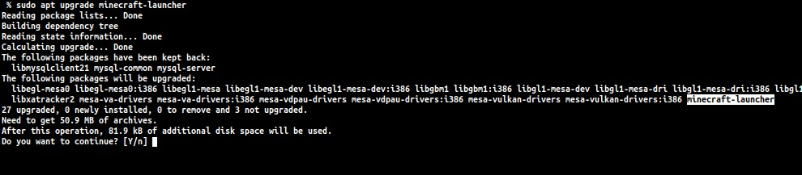

# Doregon's Java Edition Repository

*Maybe Microsoft will take a hint!*

**NOTICE:** This APT repository may no longer be needed as issue #1 reports that Linux systems have gotten automatic update utilities. I have only seen this on Arch (and it already happened either way) so tests are being done to make sure that Debian based systems actually have an auto update mechanism. If that is the case, **this APT repository will be closed.**

This repository is an unofficial APT server for Minecraft: Java Edition.

## Beta

This APT repository is new and isn't completely finished yet. There could be some work done to make this repository more organized and clean, and possibly produce beta versions of the Launcher.

## Features

- Update Minecraft using APT!
- Searches for new Launcher updates every hour
- No external routes, straight from launcher.mojang.com!
- Keeps old Launcher versions, in case they are needed
- Easy install script
- Open-source (obviously)
- Available to all

## Installation

To add this APT repository to your sources and automatically update your package lists, run the following command in your terminal:

`curl -fsSL 'https://raw.githubusercontent.com/Doregon/minecraft-repo/main/install.sh' | bash`

Once the script completes, you can run   
If you don't have it: `sudo apt install minecraft-launcher`  
If you already have it: `sudo apt upgrade minecraft-launcher`

Specifying a version is easy too:  
`sudo apt install minecraft-launcher=<version>`

A list of versions can easily be found in the `Packages` file on this repository.

## Security

None of the .deb files are modified when they get to this APT repository. All of the debs come straight from launcher.mojang.com, which is the link that you are sent to when you hit the "Download" button for the .deb file on the website. This is simply just an easier way to download the launcher without having to go to the website every single time.

## Versioning

The Minecraft installer isn't optimized for an APT repository to deliver it. Because of this, the version numbers are going to be _way_ different, with one being a number like 2.2.5149 and another being like 888. This is because of how Mojang codes three different parts of the Launcher, with the Launcher itself, the Bootstrap, and the UI. If you have issues updating or installing, use the `minecraft-launcher=<version>`.

This may present issues with updating from something like 888 -> 2.2.xxxx, but this has not been tested and will be worked on with the next update that makes the version number go back to 2.2.xxxx.
  
## Licensing

The code I wrote is licensed under GNU GPL-3.0. The actual .deb files are subject to Mojang's licenses, and the Terms of Use technically says that redistributing Minecraft is not allowed. Maybe if they did something like this, I wouldn't have to, so I honestly don't care.
